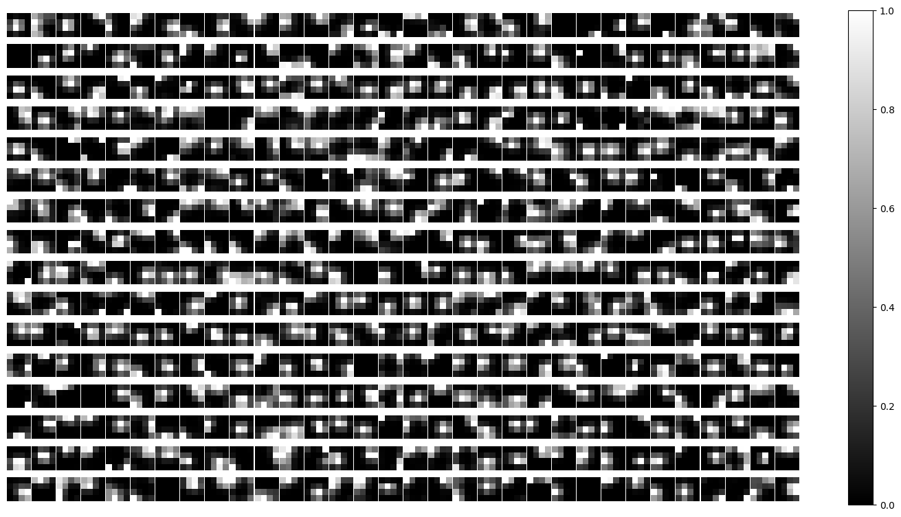
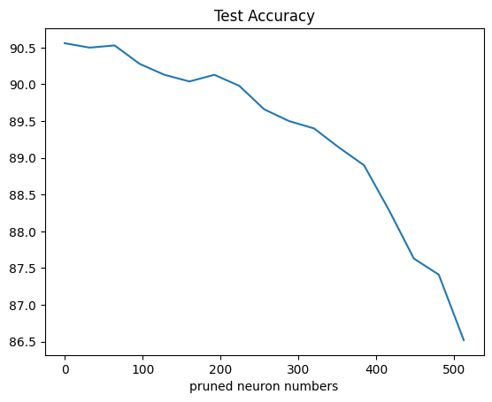
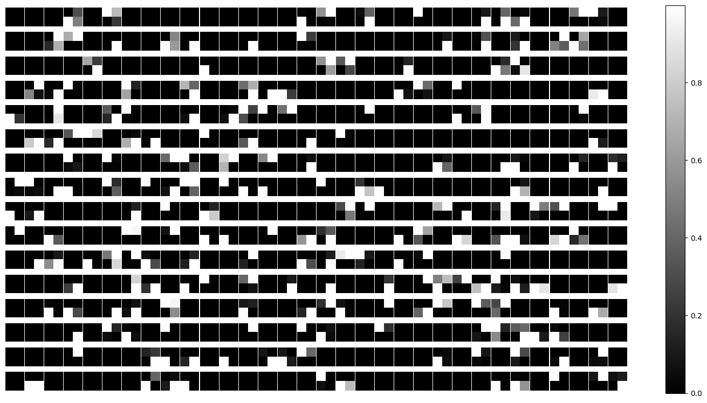
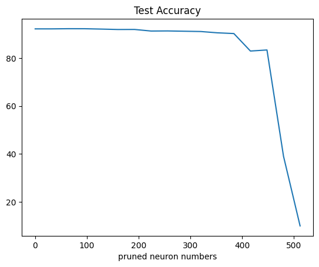
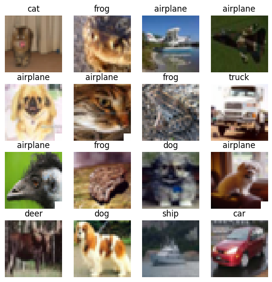
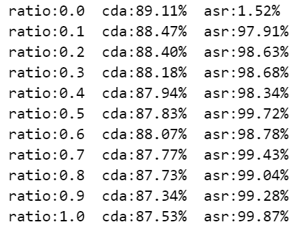
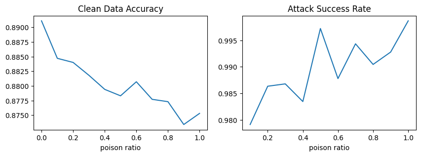

# Computer-Vision-Experiment
Computer Vision, CS, HUST, 2023  <br>
If you find my project useful, don't hesitate to give it a star.

## Exp1: Regression

Design a feedforward neural network to do regression task. Please refer to [exp1](exp1) for more details.

- A Simple Fully Connected Neural Network


- Different Hidden Layer Numbers

  

- Different Neuron Numbers

  

- Different Activation Functions

  

## Exp2: CIFAR-10 Image Classification Based On CNN

Please refer to [exp2](exp2) for more details.

Download work_dir [here](https://drive.google.com/drive/folders/1O2jsRZCIPPoS6uzmSbIFIsVM_SGvNybJ?usp=share_link), which contains training logs, json files and .pth files.

Folder structure:

```
Computer-Vision-Experiment\exp2
│ command.txt
│ exp2_cifar10.ipynb
├─configs       
├─datasets
│  └─cifar-10-batches-py
│          batches.meta
│          data_batch_1
│          data_batch_2
│          data_batch_3
│          data_batch_4
│          data_batch_5
│          readme.html
│          test_batch      
├─modules
├─tools
└─work_dir
    ├─resnet
    |  ├─resnet18
    │  ├─resnet34
    │  ├─resnet50
    │  └─resnet9
    └─vgg
        ├─vgg11_bn    
        ├─vgg13_bn
        ├─vgg16_bn
        └─vgg19_b
```

Results:

|          | Total Accuracy | plane  | car    | bird   | cat    | deer   | dog    | frog   | horse  | ship   | truck  |
| -------- | -------------: | :----: | ------ | ------ | ------ | ------ | ------ | ------ | ------ | ------ | ------ |
| Resnet9  |         90.56% | 91.8%  | 95.90% | 86.60% | 80.40% | 91.40% | 85.80% | 93.30% | 91.50% | 94.90% | 94.00% |
| VGG11_bn |         90.42% | 93.00% | 92.50% | 85.70% | 84.20% | 89.80% | 82.40% | 93.30% | 93.50% | 95.90% | 93.90% |
| VGG13_bn |         92.18% | 93.70% | 96.10% | 91.10% | 79.50% | 93.60% | 87.30% | 94.70% | 95.60% | 95.40% | 94.80% |
| VGG16_bn |         91.91% | 94.90% | 96.70% | 90.40% | 81.70% | 95.10% | 86.70% | 93.60% | 92.50% | 92.50% | 95.00% |
| VGG19_bn |         91.81% | 93.10% | 97.20% | 88.40% | 85.40% | 92.30% | 87.10% | 91.40% | 94.00% | 95.00% | 94.20% |
| Resnet18 |         90.76% | 93.20% | 95.20% | 84.50% | 76.30% | 91.80% | 89.60% | 93.50% | 93.90% | 95.60% | 94.00% |
| Resnet34 |         90.13% | 91.90% | 95.80% | 84.40% | 77.50% | 93.30% | 83.20% | 92.60% | 94.20% | 95.00% | 93.40% |
| Resnet50 |         91.41% | 93.20% | 95.50% | 88.20% | 80.50% | 92.30% | 85.50% | 96.20% | 92.70% | 95.60% | 94.40% |


- A Simple Resnet (Resnet9)

  


  

- VGG11_bn

  

- VGG13_bn

  

- VGG16_bn

  

- VGG19_bn

  

- Compare VGG

  

- ResNet13

  

- ResNet34

  

- ResNet50

  

- Compare ResNet

  

## Exp3: Compress Deep Neural Network With Pruning

Please refer to [exp3](exp3) for more details.

Download work_dir [here](https://drive.google.com/drive/folders/1O2jsRZCIPPoS6uzmSbIFIsVM_SGvNybJ?usp=share_link), which contains training logs, json files and .pth files.

In this experiment, I only use ResNet9 and VGG13_bn trained in [exp2](exp2).

Folder structure is the same as exp2.

Results:
- ResNet9
  <br>
  The feature maps of the last conv layer:
  

  Test accuracy change with respect to pruned neuron numbers:
  

- VGG13_bn
  <br>
  The feature maps of the last conv layer:
  

  Test accuracy change with respect to pruned neuron numbers:
  

Analysis is in the [exp3_report](exp3/report.pdf).


## Exp4: Backdoor Attacks on DNN

Please refer to [exp4](exp4) for more details.

Download work_dir and pth_files [here](https://drive.google.com/drive/folders/1zzJWZ2vlwAiaMR9RakUn-hKo3EM1qQ2Y?usp=share_link), which contains training logs, json files and .pth files.

Folder structure:
```
Computer-Vision-Experiment\exp4
│  exp4_backdoor_attacks.ipynb
│  
├─configs
│  │  vgg13_bn.py
│
├─datasets
├─modules
│  │  vgg.py
│  │  __init__.py
│
├─pth_files
├─tools
│  │  data_poison.py
│  │  test.py
│  │  train.py
│  │  __init__.py
│          
└─work_dir
```

As shown below, backdoor trigger is a 4x4 white square on the bottom right corner of the input image and attack target is airplane.



Results:


