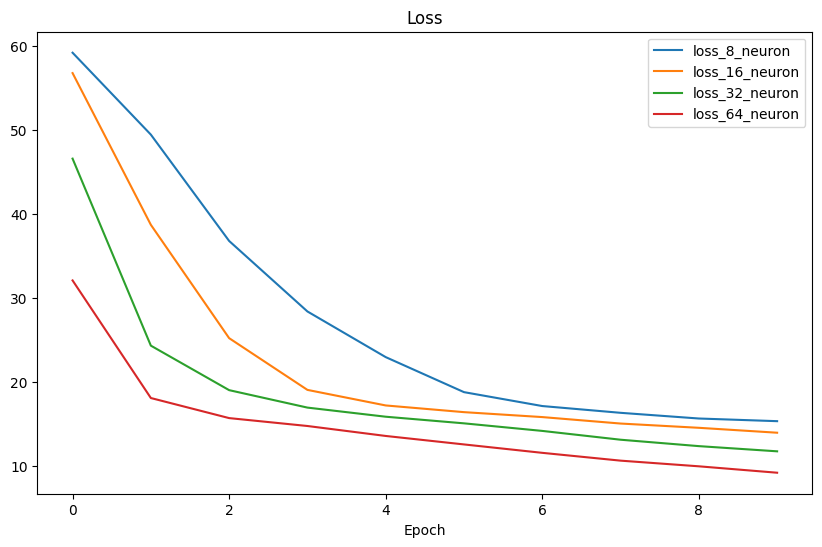
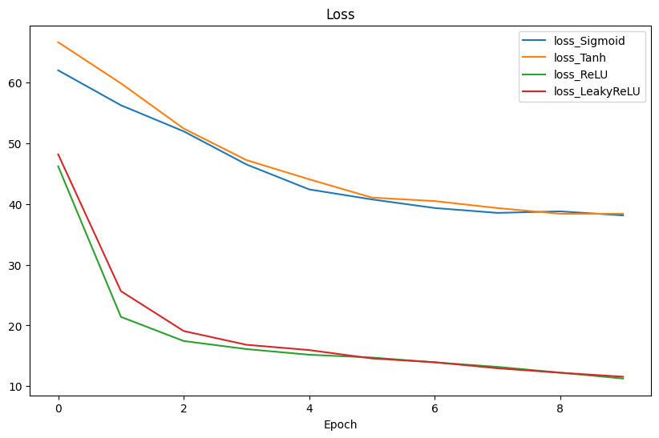

## Exp1: Regression

Design a feedforward neural network to do regression task. 
Please refer to [exp1 requirements](./%E4%B8%8A%E6%9C%BA%E5%AE%9E%E9%AA%8C%E4%B8%80.docx) for more details.

- A Simple Fully Connected Neural Network
  

- Different Hidden Layer Numbers

  

- Different Neuron Numbers

  

- Different Activation Functions
  
